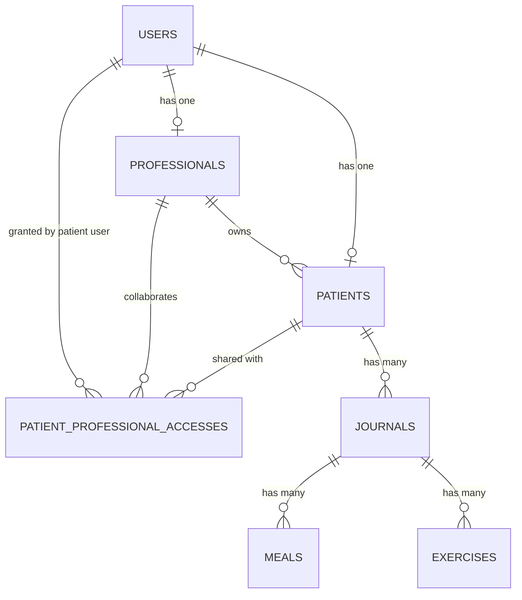

# Engineering Requirements Document — Professional Area (Balansi)

## 1. Architecture Overview

The Professional Area introduces ownership-aware access control for patient data, professional-led onboarding, and mandatory patient personal data completion on first login.

**Key Components:**
- **Frontend**: Rails views for professional patient list, patient profile, sharing, and first-login completion gate.
- **Backend**: Ruby on Rails (authorization, onboarding link context, field-level update rules).
- **Database**: PostgreSQL (`professionals`, evolved `patients`, `patient_professional_accesses`).
- **Observability**: Structured Rails logs aggregated in CloudWatch reports/dashboards.

**Key Design Decisions:**
- **Single Patient Profile per Patient User**: owner relationship stored in existing `patients.professional_id` (no rename in v1).
- **Shared Access Table**: non-owner access modeled in `patient_professional_accesses`.
- **Split Edit Ownership**:
  - patient edits personal fields (`gender`, `birth_date`, `weight_kg`, `height_cm`, `phone_e164`)
  - owner professional edits clinical fields (`daily_calorie_goal`, `bmr`, `steps_goal`, `hydration_goal`)
- **Phone Storage**: one field in E.164 (`phone_e164`) using `phonelib` for validation/normalization.
- **First Login Gate**: patient cannot proceed until required personal fields are valid.

---

## 2. Data Model / ERD

### 2.1 Entities

#### User (existing)

Identity entity from authentication module.

| Field | Type | Constraints | Description |
|---|---|---|---|
| `id` | bigint | PK | User identifier |
| `name` | string | NOT NULL | Display name |
| `email` | string | NOT NULL, UNIQUE | Login email |
| `cognito_id` | string | NOT NULL, UNIQUE | Cognito subject |
| `timezone` | string | NOT NULL | User timezone |
| `language` | string | NOT NULL | User language |

#### Professional (new)

Professional account linked to a user.

| Field | Type | Constraints | Description |
|---|---|---|---|
| `id` | bigint | PK | Professional identifier |
| `user_id` | bigint | NOT NULL, UNIQUE, FK -> `users.id` | One professional profile per user |
| `created_at` | datetime | NOT NULL | Creation timestamp |
| `updated_at` | datetime | NOT NULL | Update timestamp |

#### Patient (evolved)

Patient profile with owner professional and split edit ownership fields.

| Field | Type | Constraints | Description |
|---|---|---|---|
| `id` | bigint | PK | Patient identifier |
| `user_id` | bigint | NOT NULL, UNIQUE, FK -> `users.id` | One patient profile per patient user |
| `professional_id` | bigint | NOT NULL, FK -> `professionals.id` | Owner professional (existing column, kept in v1) |
| `gender` | string/enum | NULL until completion | Allowed: `male`, `female` |
| `birth_date` | date | NULL until completion | Formatted date input |
| `weight_kg` | decimal | NULL until completion | Kg with min/max validation |
| `height_cm` | decimal | NULL until completion | Cm with min/max validation |
| `phone_e164` | string(20) | NULL until completion | E.164 phone (`+5511999999999`) |
| `profile_completed_at` | datetime | NULL | Set after mandatory completion |
| `profile_last_updated_at` | datetime | NULL | Last profile update timestamp (any profile edit) |
| `daily_calorie_goal` | integer | NULL | Owner professional-managed |
| `bmr` | integer | NULL | Owner professional-managed |
| `steps_goal` | integer | NULL | Owner professional-managed |
| `hydration_goal` | integer | NULL | Owner professional-managed |
| `created_at` | datetime | NOT NULL | Creation timestamp |
| `updated_at` | datetime | NOT NULL | Update timestamp |

#### PatientProfessionalAccess (new)

Shared collaborator access for non-owner professionals.

| Field | Type | Constraints | Description |
|---|---|---|---|
| `id` | bigint | PK | Access record identifier |
| `patient_id` | bigint | NOT NULL, FK -> `patients.id` | Patient |
| `professional_id` | bigint | NOT NULL, FK -> `professionals.id` | Shared professional |
| `granted_by_patient_user_id` | bigint | NOT NULL, FK -> `users.id` | Audit trail |
| `created_at` | datetime | NOT NULL | Creation timestamp |
| `updated_at` | datetime | NOT NULL | Update timestamp |

### 2.2 Entity Relationship Diagram



---

## 3. Database Schema / Migrations

### 3.1 New `professionals` table

```ruby
class CreateProfessionals < ActiveRecord::Migration[8.1]
  def change
    create_table :professionals do |t|
      t.references :user, null: false, foreign_key: { on_delete: :cascade }, index: { unique: true }
      t.timestamps
    end
  end
end
```

### 3.2 Evolve `patients` table

```ruby
class EvolvePatientsForProfessionalArea < ActiveRecord::Migration[8.1]
  def change
    add_column :patients, :gender, :string
    add_column :patients, :birth_date, :date
    add_column :patients, :weight_kg, :decimal, precision: 5, scale: 2
    add_column :patients, :height_cm, :decimal, precision: 5, scale: 2
    add_column :patients, :phone_e164, :string, limit: 20
    add_column :patients, :profile_completed_at, :datetime
    add_column :patients, :profile_last_updated_at, :datetime

    add_index :patients, :user_id, unique: true
    add_index :patients, :professional_id
  end
end
```

Notes:
- Keep existing `patients.professional_id` as owner professional column in v1.
- No column rename required for this release.

### 3.3 New `patient_professional_accesses` table

```ruby
class CreatePatientProfessionalAccesses < ActiveRecord::Migration[8.1]
  def change
    create_table :patient_professional_accesses do |t|
      t.references :patient, null: false, foreign_key: { on_delete: :cascade }
      t.references :professional, null: false, foreign_key: { on_delete: :cascade }
      t.references :granted_by_patient_user, null: false, foreign_key: { to_table: :users }
      t.timestamps
    end

    add_index :patient_professional_accesses, [:patient_id, :professional_id], unique: true, name: "patient_prof_access_unique_idx"
    add_index :patient_professional_accesses, [:professional_id, :patient_id], name: "patient_prof_access_prof_patient_idx"
  end
end
```

## 4. Rails Models

### 4.1 Patient model (core validations and ownership)

```ruby
class Patient < ApplicationRecord
  belongs_to :user
  belongs_to :professional # owner professional (existing column)

  has_many :patient_professional_accesses, dependent: :destroy
  has_many :shared_professionals, through: :patient_professional_accesses, source: :professional

  enum :gender, { male: "male", female: "female" }, validate: true

  validates :phone_e164, length: { maximum: 20 }, allow_nil: true
  validates :daily_calorie_goal, numericality: { greater_than: 0, less_than: 50_000 }, allow_nil: true
  validates :bmr, numericality: { greater_than: 0, less_than: 10_000 }, allow_nil: true
  validates :steps_goal, numericality: { greater_than: 0, less_than: 100_000 }, allow_nil: true
  validates :hydration_goal, numericality: { greater_than: 0, less_than: 20_000 }, allow_nil: true
end
```

### 4.2 Phone validation (`phonelib`)

Recommended gems:
- `phonelib`
- optionally `phonelib-rails` integration helpers

Validation intent:
- parse with BR as default country context for local inputs
- persist canonical value in E.164

```ruby
def normalize_phone
  parsed = Phonelib.parse(phone_e164, "BR")
  self.phone_e164 = parsed.full_e164 if parsed.valid?
end
```

### 4.3 Access model constraints

`PatientProfessionalAccess` constraints:
- unique patient/professional pair enforced by index + validation

---

## 5. Business Rules & Validations

### 5.1 Access rules

- Owner professional:
  - read patient records
  - edit only clinical goal fields
- Shared professional:
  - read-only
  - when patient grants access, system creates a row in `patient_professional_accesses`
- Patient:
  - edit only personal fields
  - can share access with additional professionals

### 5.2 First-login completion gate

Required before regular access:
- `gender`
- `birth_date`
- `weight_kg`
- `height_cm`
- `phone_e164`

Gate condition:
- access blocked unless all required fields are valid
- set `profile_completed_at` when completion succeeds

### 5.3 Input requirements

- `gender`: only `male` or `female`
- `birth_date`: formatted date field (no calendar picker)
- `weight_kg` and `height_cm`: min/max range validation (limits configured at app level)
- `phone_e164`: single international phone field with country code
- profile screen must display:
  - `profile_last_updated_at`

---

## 6. Indexes & Performance

Critical indexes:
- `patients(user_id)` unique
- `patients(professional_id)`
- `patient_professional_accesses(patient_id, professional_id)` unique
- `patient_professional_accesses(professional_id, patient_id)`

Query patterns supported:
- professional patient list split by owner/shared
- fast authorization checks for patient access

---

## 7. Observability & Metrics (v1)

Initial implementation via logs + CloudWatch:
- emit structured events:
  - `professional_patient_list_viewed`
  - `professional_patient_profile_viewed`
  - `professional_patient_journal_viewed`
- fields:
  - `professional_id`
  - `patient_id`
  - `access_type` (`owner` or `shared`)
  - `occurred_at`

These events back PRD success metrics for:
- patients per professional (owner/shared)
- professional follow-up activity and coverage.

---

## 8. Migration Order

1. Create `professionals`.
2. Add personal profile columns and profile-update metadata columns to `patients`.
3. Add unique index strategy for one patient profile per `user_id`.
4. Create `patient_professional_accesses`.
5. Switch application reads/writes to one owner (`patients.professional_id`) + shared access table.

---

## 9. Summary

This ERD defines a practical implementation path from single-professional patient linkage to:
- owner + shared professional access,
- onboarding by signup link context,
- patient-first completion gate,
- and clear field-level ownership between patient and owner professional.

---

## 10. Implementation Plan (BAL-15)

### Phase 1 — Data Model Foundation ✅ **Completed**

- Create `professionals`.
- Evolve `patients` with:
  - `gender`, `birth_date`, `weight_kg`, `height_cm`, `phone_e164`
  - `profile_completed_at`
  - `profile_last_updated_at`
- Create `patient_professional_accesses`.
- Keep `patients.professional_id` as owner professional.

Exit criteria:
- [x] migrations run cleanly
- [x] associations/validations covered by model specs

Implementation notes:
- Added `professionals` and `patient_professional_accesses` tables.
- Evolved `patients` with personal/profile metadata fields and unique `user_id`.
- Added `patients.professional_id -> professionals.id` foreign key.
- Normalized migration path for existing patient records to canonical `professional_id = 1` when records exist.

Actual files changed (Phase 1):
- `db/migrate/20260223110000_create_professionals.rb`
- `db/migrate/20260223110100_evolve_patients_for_professional_area.rb`
- `db/migrate/20260223110200_create_patient_professional_accesses.rb`
- `app/models/professional.rb`
- `app/models/patient_professional_access.rb`
- `app/models/patient.rb`
- `app/models/user.rb`

### Phase 2 — Owner Assignment in Signup Flow ✅ **Completed**

- Support signup link with professional context.
- On patient signup completion, set owner in `patients.professional_id`.

Exit criteria:
- [x] patient created from link is linked to expected owner professional
- [x] invalid/missing professional context is rejected safely

Implementation notes:
- Removed implicit fallback owner assignment (`professional_id = 1`) from signup context parsing.
- Enforced strict professional-context validation for new patient creation:
  - `professional_id` must be present in callback business state,
  - must parse as a positive integer,
  - and must resolve to an existing `Professional`.
- Preserved authentication for existing users who already have a patient profile, even when callback state has no professional context.

Actual files changed (Phase 2):
- `app/interactions/auth/sign_up_interaction.rb`
- `spec/interactions/auth/sign_up_interaction_spec.rb`

### Phase 3 — First Login Mandatory Completion Gate

- Enforce completion gate for patient first login.
- Required fields: `gender`, `birth_date`, `weight_kg`, `height_cm`, `phone_e164`.
- Block access to remaining modules until completion succeeds.

Exit criteria:
- gate blocks access when fields are missing
- completion unlocks access and sets `profile_completed_at`

### Phase 4 — Split Profile Edit Ownership

- Patient edits only personal fields.
- Owner professional edits only clinical goal fields.
- Shared professional remains read-only.
- Update `profile_last_updated_at` on profile edits.

Exit criteria:
- unauthorized edits are blocked
- allowed edits persist correctly

### Phase 5 — Sharing + Professional Patient List

- Patient shares access with a professional by creating row in `patient_professional_accesses`.
- Build professional patient list with `owner` vs `shared` label.

Exit criteria:
- sharing preserves owner and adds collaborator access
- patient list labels are accurate

### Phase 6 — Observability and Metrics

- Emit structured logs for:
  - `professional_patient_list_viewed`
  - `professional_patient_profile_viewed`
  - `professional_patient_journal_viewed`
- Aggregate via CloudWatch for PRD success metrics.

Exit criteria:
- logs queryable with `professional_id`, `patient_id`, `access_type`, `occurred_at`

### Phase 7 — Final Integration and QA

- Run full regression for auth/journal/professional flows.
- Fix integration issues and prepare final release checklist.

Exit criteria:
- critical flows pass and acceptance criteria are met

---

## 11. References

- Linear Ticket: [BAL-15 — Professional features](https://linear.app/balansi/issue/BAL-15/professional-features)
- PRD: [Professional PRD](./prd.md)
- ERD: [Professional ERD](./erd.md)

---

**Document Version**: 1.0  
**Last Updated**: 2026-02-20  
**Status**: Draft - Pending Review
